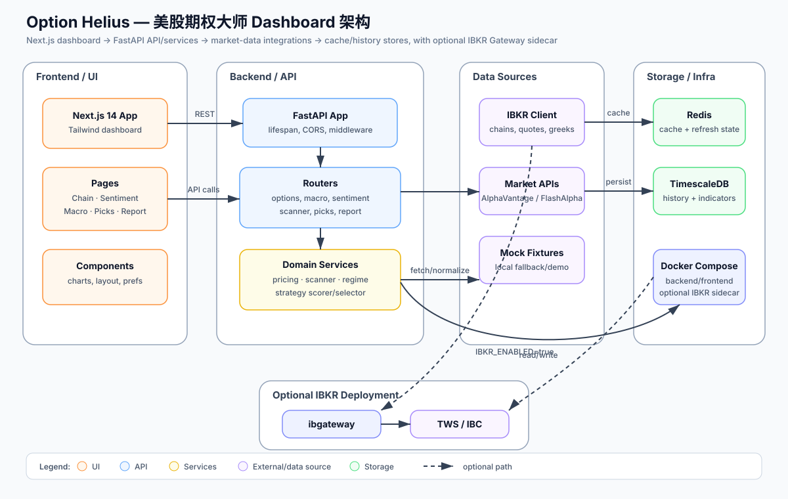

# 美股期权大师 Dashboard

Professional US equity options analytics platform.

## Quick Start

```bash
docker compose up -d
```

Frontend: http://localhost:3000  
API: http://localhost:8000/docs  
TimescaleDB: localhost:5432  
Redis: localhost:6379

## Architecture



Editable source: [`docs/system-architecture.drawio`](docs/system-architecture.drawio)

## Modules

1. **Options Chain** — Greeks, OI, IV Rank, GEX, Max Pain
2. **Sentiment** — Unusual activity, Put/Call ratio, Whale alerts
3. **Macro** — VIX/VVIX, yield curve, earnings calendar
4. **Analytics** — Payoff diagrams, spread builder
5. **Weekly Picks** — Safety-margin filtered strategies

## Planning

See `.planning/` for GSD workflow files:
- `PROJECT.md` — Vision & stack
- `REQUIREMENTS.md` — REQ-001 through REQ-009
- `ROADMAP.md` — 5 phases
- `STATE.md` — Session state
